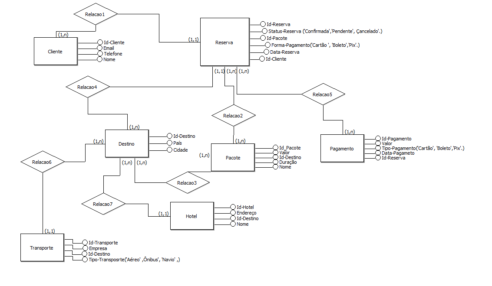
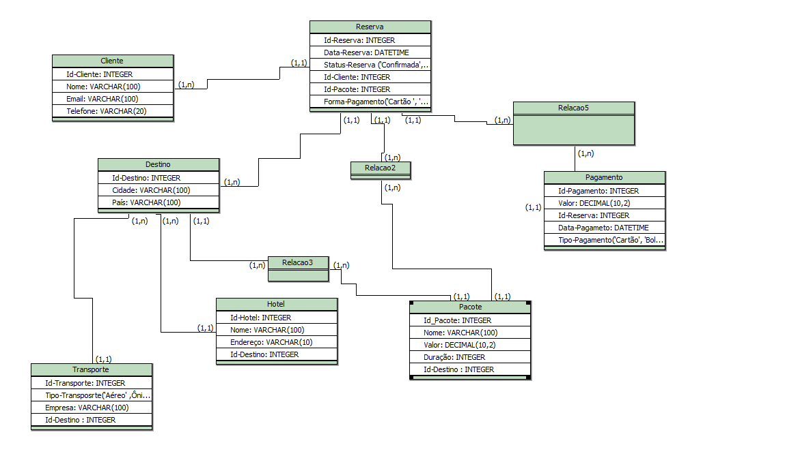

<p align="center">
  
</p>
<br>
<p align="center">
  
  
  
  
</p>

<p align="center">
  <a href="https://agencia-viagens-html.vercel.app/" target="_blank" rel="noopener noreferrer">Link para o site</a>
</p>

# Sumário

1.  [Resumo](#-resumo)
2.  [Funcionalidades](#-funcionalidades)
3.  [Banco de Dados](#-banco-de-dados)
    - [Diagrama Conceitual](#diagrama-conceitual)
    - [Esquema Lógico](#esquema-lógico)
    - [Diagrama Físico](#diagrama-físico)

## 🔎 Resumo

TravelEXplore – Sua Jornada Começa Aqui!

O site da TravelEXplore é uma plataforma completa para quem deseja planejar e reservar viagens de forma prática e segura. Entre as principais funcionalidades, estão:

✅ Descobrir – Encontre os melhores destinos e explore novas possibilidades de viagem.
✅ Explorar – Acesse informações detalhadas sobre lugares incríveis ao redor do mundo.
✅ Cadastrar – Crie sua conta para salvar suas preferências e acompanhar suas reservas.
✅ Local, Data de Ida e Data de Volta – Personalize sua busca e encontre as melhores opções de viagem.
✅ Principais Escolhas para Você – Receba recomendações personalizadas como pacotes de viagens, com base no seu perfil e preferências.

Futuras Melhorias 🚀

Estou trabalhando para tornar a TravelEXplore ainda mais interativa e intuitiva! Em breve, adicionarei novas telas, como a de cadastro e perfil do usuário, para facilitar o gerenciamento. Também estou desenvolvendo um mapa interativo, que permitirá explorar destinos de forma mais dinâmica. Além disso, vou aprimorar a interação no site, tornando a navegação mais fluida e personalizada! ✈️🌍

## 📊 Banco de dados

### Diagrama conceitual



### Esquema lógico



### Diagrama físico

```-- Gera��o de Modelo f�sico
-- Sql ANSI 2003 - brModelo.


CREATE TABLE Cliente (
Id-Cliente INTEGER,
Nome VARCHAR(100),
Email VARCHAR(100),
Telefone VARCHAR(20)
)

CREATE TABLE Destino (
Id-Destino INTEGER,
Cidade VARCHAR(100),
Pa�s VARCHAR(100)
)

CREATE TABLE  Pacote (
Id_Pacote INTEGER,
Nome VARCHAR(100),
Valor DECIMAL(10,2),
Dura��o INTEGER,
Id-Destino  INTEGER
)

CREATE TABLE Reserva (
Id-Reserva INTEGER,
Data-Reserva DATETIME,
Status-Reserva ('Confirmada','Pendente', �ancelado'.) VARCHAR(20),
Id-Cliente INTEGER,
Id-Pacote INTEGER,
Forma-Pagamento('Cart�o ', 'Boleto','Pix'.) VARCHAR(10)
)

CREATE TABLE Transporte (
Id-Transporte INTEGER,
Tipo-Transposrte('A�reo' ,�nibus', 'Navio' ,) VARCHAR(10),
Empresa VARCHAR(100),
Id-Destino  INTEGER
)

CREATE TABLE Hotel (
Id-Hotel INTEGER,
Nome VARCHAR(100),
Endere�o VARCHAR(10),
Id-Destino INTEGER
)

CREATE TABLE Pagamento (
Id-Pagamento INTEGER,
Valor DECIMAL(10,2),
Id-Reserva INTEGER,
Data-Pagameto DATETIME,
Tipo-Pagamento('Cart�o', 'Boleto','Pix'.) VARCHAR(10)
)

CREATE TABLE Relacao2 (

)

CREATE TABLE Relacao3 (

)

CREATE TABLE Relacao5 (

)

```
